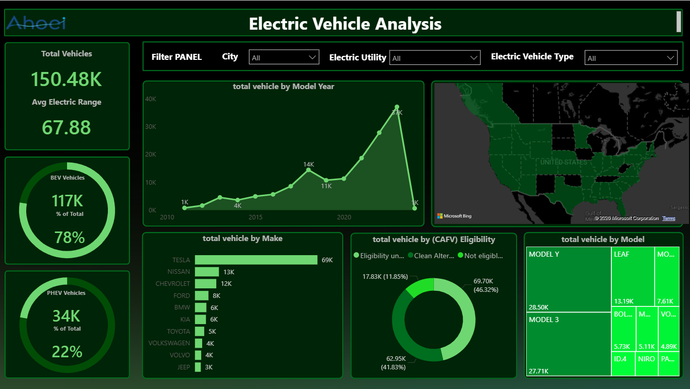

# Project 01 — Power BI Dashboard

## Overview

This project presents an interactive business dashboard developed using Microsoft Power BI.

The project focuses on transforming raw data into an interactive and visually structured dashboard for business analysis and decision-making.

## Key Skills

- Data Modeling
- Data Transformation
- DAX
- Interactive Dashboard Design
- Data Visualization
- KPI Analysis
- Business Reporting

## Dashboard Preview

## Power BI File

The complete interactive Power BI report is available in:

**[Download the Power BI File](./project-01.pbix)**

## Tools

**Microsoft Power BI · DAX · Data Modeling · Data Visualization**

## Author

**Mohammad Amin Mohammadi Ahoei**
