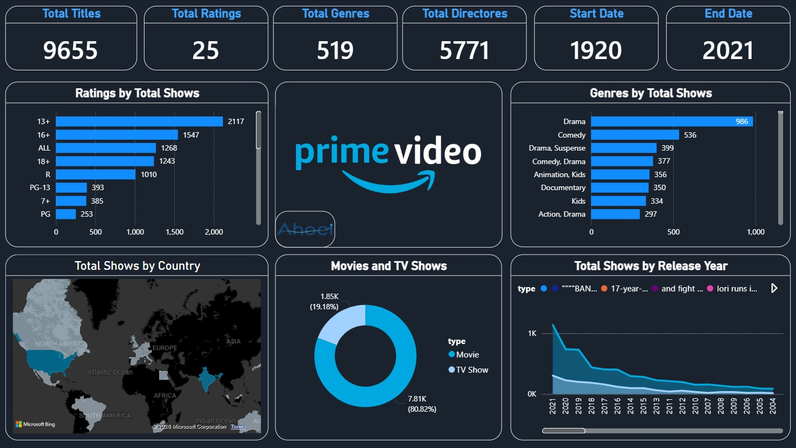

# Project 02 — Amazon Prime Content Analysis

## Overview

This project presents an interactive **Power BI dashboard** designed to explore and analyze the content catalog of Amazon Prime.

The dashboard transforms a content dataset into an interactive analytical view, allowing users to explore the catalog across content type, release year, rating, genre, country, and other attributes.

## Analytical Focus

The dashboard explores:

- Movies vs. TV Shows
- Content distribution by country
- Release trends over time
- Ratings and audience classification
- Genre distribution
- Overall content characteristics

## Dashboard Preview

## Key Skills

- Data Modeling
- Data Visualization
- Interactive Dashboard Design
- KPI Development
- Filtering and Exploration
- Business-Oriented Reporting

## Power BI Report

The complete interactive Power BI file is available below:

**[Download the Power BI Report](./project-02.pbix)**

## Tools

**Microsoft Power BI · DAX · Data Modeling · Data Visualization**

## Author

**Mohammad Amin Mohammadi Ahoei**
